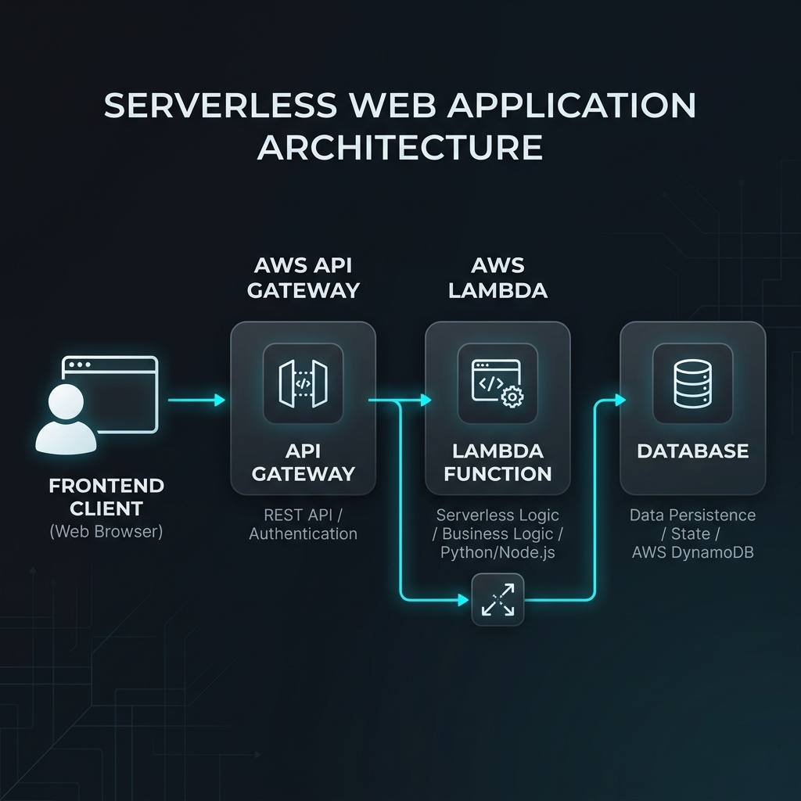

# 📍 Jerusalem Attendance System

<div align="center">
  <p><strong>A high-performance, geolocation-based attendance tracking web application.</strong></p>
  
  
  
  
  
</div>



## 📖 Overview

The **Jerusalem Attendance System** is a modern, modular, vanilla JavaScript web application designed to track student attendance securely and accurately using the browser's Geolocation API. It features a sleek, mobile-first glassmorphic UI and integrates seamlessly with an AWS Serverless backend (Lambda + API Gateway).

This repository demonstrates industry best practices in frontend engineering:
- **Modular Architecture**: Clean separation of concerns using ES6 Modules.
- **Security First**: Protection against XSS attacks with careful DOM manipulation.
- **Maintainability**: Clear file structure, utility functions, and responsive CSS variables.
- **Performance**: Lightweight vanilla JS implementation with no heavy frameworks, bundled with Vite.

## ✨ Features

- **🌍 Precise Geolocation Tracking**: Uses `navigator.geolocation` with high-accuracy mode to ensure attendance is only marked from the actual classroom location.
- **🔐 Anti-Spam Cooldown System**: Built-in 5-minute cooldown timer to prevent duplicate attendance submissions.
- **🎨 Modern Glassmorphic UI**: Beautiful, responsive design with smooth micro-animations, crafted with Vanilla CSS and custom properties.
- **📱 Mobile-First Experience**: Optimized for all devices, handling iOS Safari quirks and visual viewport changes gracefully.
- **💾 Local State Persistence**: Remembers student details across sessions securely using browser `localStorage`.
- **⚡ Serverless Backend Integration**: Configured to connect to AWS Lambda for robust, scalable data processing.

## 📂 Project Structure

```text
jerusalem-attendance/
├── src/
│   ├── config/          # Environment & API configuration
│   ├── services/        # Business logic (AWS API & Geolocation)
│   ├── utils/           # Helper functions (Storage, DOM manipulation)
│   ├── styles/          # Global CSS and themes
│   └── main.js          # Application entry point
├── index.html           # Main HTML document
├── package.json         # Project metadata and scripts
└── vite.config.js       # Vite bundler configuration (optional)
```

## 🚀 Quick Start

### Prerequisites
- Node.js (v18+ recommended)
- NPM or Yarn

### Installation

1. **Clone the repository:**
   ```bash
   git clone https://github.com/yourusername/jerusalem-attendance.git
   cd jerusalem-attendance
   ```

2. **Install dependencies:**
   ```bash
   npm install
   ```

3. **Start the development server:**
   ```bash
   npm run dev
   ```

4. **Build for production:**
   ```bash
   npm run build
   ```

## 🛠️ Architecture Decisions & Code Quality Highlights

- **Vanilla JS over Frameworks**: To ensure lightning-fast load times and minimal bundle size, this application relies entirely on modern Vanilla JavaScript.
- **Separation of Concerns (SoC)**: UI rendering (`dom.js`), API fetching (`api.js`), and sensor reading (`geolocation.js`) are decoupled, making the app highly testable and extensible.
- **Error Handling**: Implements a robust try/catch approach with user-friendly error messages specifically mapping Geolocation error codes (e.g., Permission Denied vs. Timeout).

## 📄 License

This project is licensed under the MIT License - see the LICENSE file for details.

---
